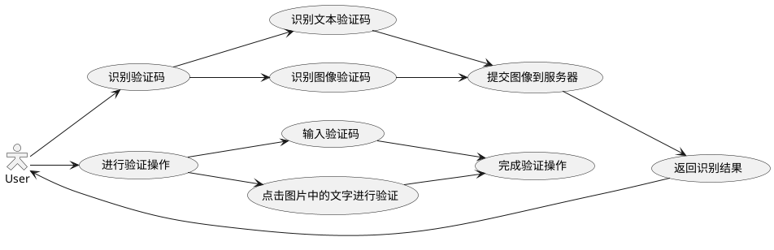

# Captcha Assistant

[TOC]

## 1. 项目描述

此 NVDA 插件用于协助识别和操作验证码。

## 2. 项目背景

在登陆某些网站时会遇到要求输入验证码的问题，这给残障人士带来许多不便。
本插件可以识别验证码，使用户可以操作验证码或代替用户进行自动化验证操作，方便浏览网页。

## 3. 项目目标

### 3.1. 支持以下验证码

* 文本识别型 CAPTCHA（Text Recognition CAPTCHA）
* 图像识别型 CAPTCHA（Image Recognition CAPTCHA）
* 数学问题型 CAPTCHA（Math Problem CAPTCHA）
<!-- * 音频型 CAPTCHA（Audio CAPTCHA） -->
* 交互型 CAPTCHA（Interactive CAPTCHA）
* 逻辑问题型 CAPTCHA（Logic Puzzle CAPTCHA）
<!-- * 游戏型 CAPTCHA（Game CAPTCHA）
* 动态型 CAPTCHA（Dynamic CAPTCHA -->

### 3.2. 以插件的形式与 NVDA 集成

## 4. 项目架构

包括前端和后端部分。前端负责提取网页中的验证码，后端对提取到的验证码的进行识别，最后将识别到的验证码提交到用户，由用户进行操作，或对验证码自动化验证操作。

## 5. 设计概要

### 5.1. 模块介绍

#### 5.1.1. 交互模块

交互模块用于获取验证码和返回验证所需信息。其由针对各种不同类型的交互模块构成。

#### 5.1.2. 处理模块

处理模块用于识别验证码和提交验证所需信息。其由针对各种不同类型验证码的处理模块构成。

#### 5.1.3. 服务端模块

服务端模块用于连接交互模块和处理模块。

### 5.2. 交互流程图

## 6. 使用方法

有两种使用方法：NVDA插件、浏览器插件

* NVDA插件

本插件集成到NVDA软件中。使用时按下NVDA + shift + p快捷键激活插件，就可以使用

* 浏览器插件

## 7. 测试方案

## 8. Project Timeline & Weekly Milestones

8.4: 完成插件基础功能，识别文字验证码。

8.11: 顺序点击图片中文字验证码，滑块验证码。

8.18: 尽可能完善和扩展功能。
