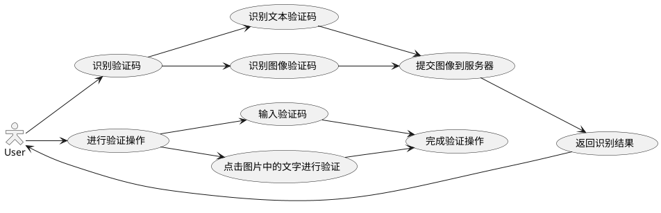

# Captcha Assistant

[TOC]

## 1. 项目描述

此 NVDA 插件用于协助识别和操作验证码。

## 2. 项目背景

验证码（CAPTCHA，全自动区分计算机和人类的图灵测试）是一种用于区分用户是人类还是计算机程序的技术。其主要目的是防止恶意行为，如自动化程序进行的批量注册、暴力破解密码、刷票、论坛灌水等。通过验证码，可以有效提高系统的安全性，确保只有人类用户才能完成某些关键操作。但随着验证码以及相对应的破译技术的相互博弈，验证码也在不断升级，图片文字识别，图片文字点选，滑块、拼图，图片分类等等，这无形中对视障者浏览互联网造成了障碍。

视障者在操作验证码时面临诸多挑战，例如：

1. 图片验证码：屏幕阅读器无法直接读取图片中的文字或数字，且这些验证码文字都有一定程度的扭曲，普通 OCR 技术难以识别，视障者无法独立完成验证。
2. 滑动拼图和文字点选验证码：这些验证码依赖视觉操作，视障者难以完成拖动或点击操作。
3. 颜色识别：有些验证码要求用户识别特定颜色的文字，这对色盲或色弱用户来说尤为困难。
4. 图片分类：例如从多张图片中找出所有带有汽车的图片，如果图片的内容相近，也许屏幕阅读器或浏览器所带有的图像描述也无法识别，或者这些图片不具备图像元素，可能不会触发浏览器的图像描述。
5. 语音验证码：虽然语音验证码对视障者友好，但国内应用较少。

通过开发适用于各类屏幕阅读器的验证码识别插件，可以在一定程度上增强视障者浏览互联网的体验，但这始终不是长久之计。我们更希望看到更多用户无感知的验证码方式，这对所有用户的互联网体验意义都是重大的

## 3. 项目目标

本插件可以识别验证码，使用户可以操作验证码或代替用户进行自动化验证操作，方便浏览网页。

### 3.1. 支持以下验证码

* 文本识别型 CAPTCHA（Text Recognition CAPTCHA）
* 图像识别型 CAPTCHA（Image Recognition CAPTCHA）
* 数学问题型 CAPTCHA（Math Problem CAPTCHA）
<!-- * 音频型 CAPTCHA（Audio CAPTCHA） -->
* 交互型 CAPTCHA（Interactive CAPTCHA）
* 逻辑问题型 CAPTCHA（Logic Puzzle CAPTCHA）
<!-- * 游戏型 CAPTCHA（Game CAPTCHA）
* 动态型 CAPTCHA（Dynamic CAPTCHA -->

### 3.2. 以插件的形式与 NVDA 集成

## 4. 项目架构

包括提取验证码、识别验证码、自动化验证三部分。提取验证码部分负责提取网页中的验证码，识别验证码部分通过调用AI识别功能，对提取到的验证码的进行识别，最后自动化验证部分将识别到的验证码返回，由用户手动操作输入验证，或对验证码进行自动化验证操作。

## 5. 设计概要

### 5.1. 模块介绍

#### 5.1.1. 交互模块

交互模块用于获取验证码和返回验证所需信息。其由针对各种不同类型的交互模块构成。

* 识别文本验证码：发送图片，接收文本到剪贴板。
* 基础滑块：完成滑动滑块操作。

#### 5.1.2. 处理模块

处理模块用于识别验证码和提交验证所需信息。其由针对各种不同类型验证码的处理模块构成。

使用第三方库：

* ddddocr（[Rust](https://github.com/86maid/ddddocr)）：文本、目标检测、滑块

#### 5.1.3. 服务端模块

服务端模块用于连接交互模块和处理模块。

### 5.2. 交互流程图

## 6. 使用方法

提供两种使用方法：NVDA插件、浏览器插件

* NVDA插件

本插件集成到NVDA软件中。使用时按下NVDA + shift + p快捷键激活插件，就可以使用

* 浏览器插件

以插件的形式集成到浏览器中，通过快捷键进行激活，完成验证码的自动化验证操作

## 7. 测试方案

以[训练数据](http://146.56.204.113:19199/preview)网页中的验证码为示例验证码进行测试。测试能否完成验证码的识别及验证码自动化操作

## 8. Project Timeline & Weekly Milestones

8.4: 完成插件基础功能，识别文字验证码。

8.11: 顺序点击图片中文字验证码，滑块验证码。

8.18: 尽可能完善和扩展功能。
